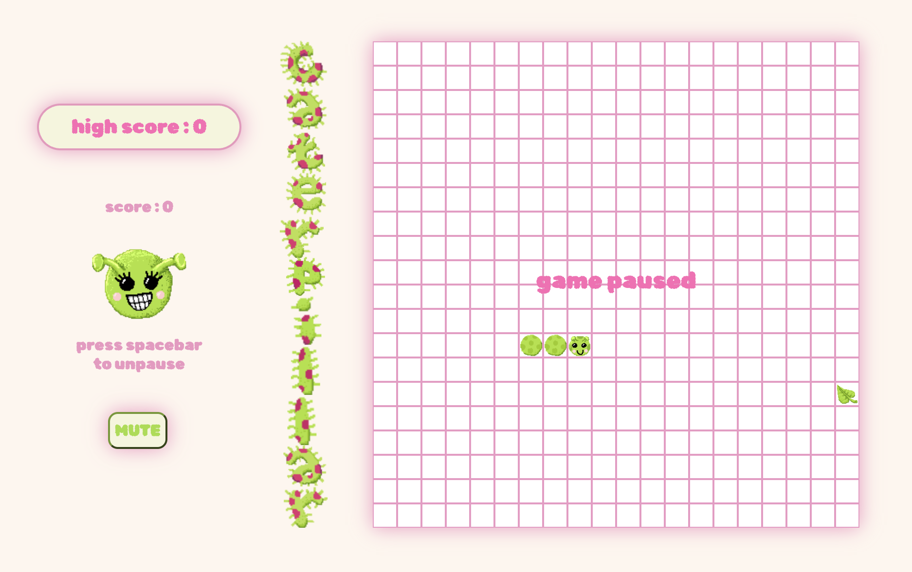
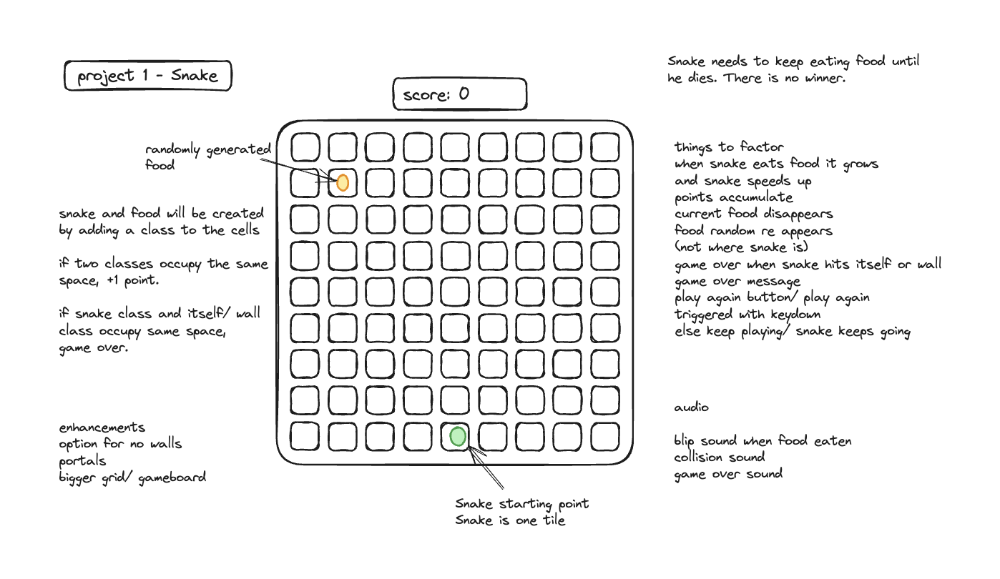
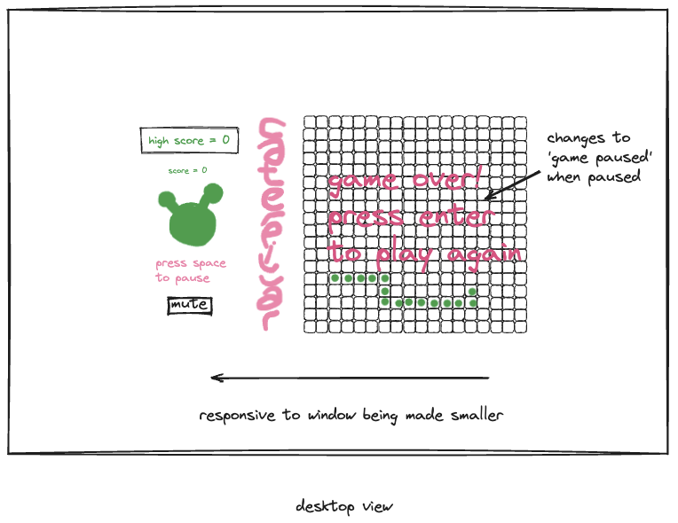
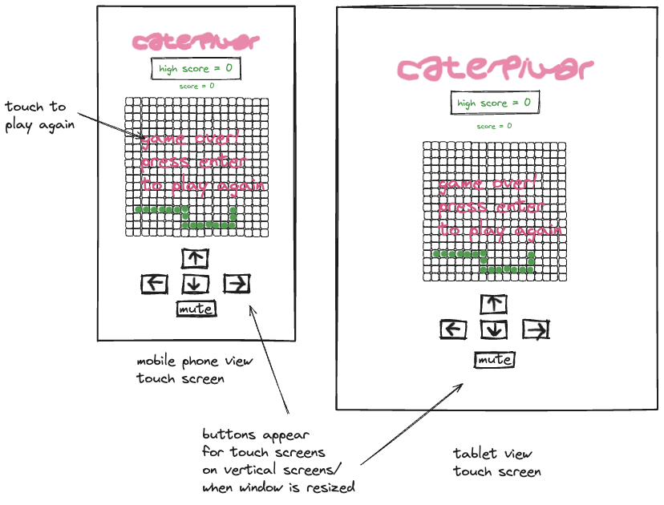
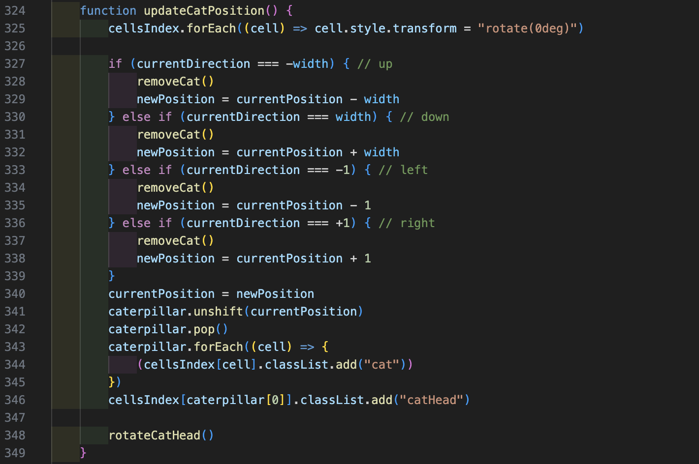
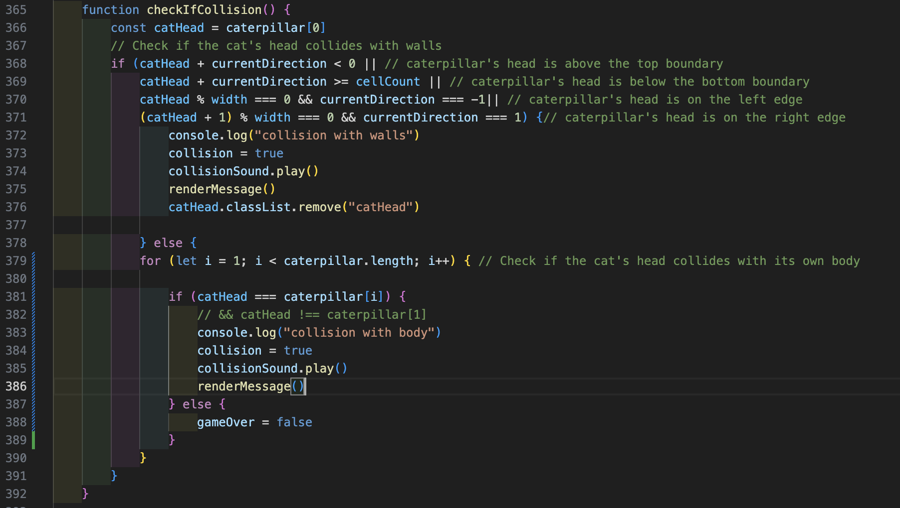
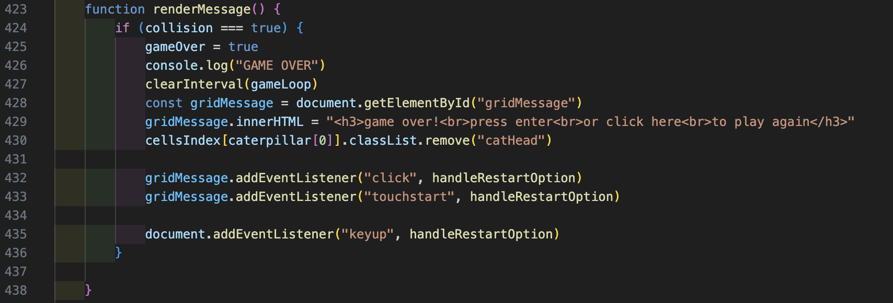

# Project One - Caterpillar
Table of Contents:
+ Project Overview
+ Deployment Link
+ Timeframe & Working Team
+ Technologies Used
+ The Brief
+ Planning
+ Build Process
+ Challenges
+ Wins
+ Key Learnings
+ Bugs
+ Future Improvements

## Project Overview

### Project 1: Caterpillar



The first project in General Assembly’s Software Engineering Immersive course, and my first ever coding project. Created using pure JavaScript, HTML, and CSS, I designed and rendered my own Caterpillar version of the classic Snake game in the browser. 

This game is desktop and mobile responsive, with the logo and caterpillar animation designed by myself.

The aim of the game is to eat as much food as you can. The more you eat, the longer the caterpillar becomes and the faster it moves. Eat the randomly appearing fruit for bonus points.

## Find the completed project here: [Caterpillar](https://joelleli.github.io/Unit1_Project_Snake/)

## Timeframe & Working Team

Timeframe was one week independently.

## Technologies Used

+ JavaScript
+ HTML5
+ CSS with keyframe animation
+ Git
+ GitHub
+ Chrome Developer Tools

## Brief

+ Render a grid based game in the browser
+ Design logic for winning and/ or scoring points
+ Use vanilla JavaScript for DOM manipulation, with HTML and CSS.
+ The ‘snake’ should move along by itself, and when it eats the food it should grow longer and the speed of movement should increase.
+ The game is over when the snake collides with itself or with the walls.
+ Deploy the game online

## Planning

I started out by researching the original Snake game to help me figure out what features and variables my game should have (such as speed of snake, length of snake’s body). Watching videos of Snake gameplay also helped me to plan the logic of the game and the order in which certain events should play out.

I started my plan by making a list of all the variables, events and possible functions my game should have and the order in which I thought they should be executed. With this functionality in mind, I then designed my initial layout on Excalidraw. Keeping the layout simple, I decided to establish the core functionality of the game first before considering styling elements and responsive design.



Once I had met the minimum requirements of the game functionality, I then designed different layouts which would change according to screen size.





## Build/Code Process

### Day 1 
I started by researching the original Snake game and making a list of style elements, core logic and functions of the game.

I then planned the variables I thought I would need, the functions and order of when the functions will be executed.

### Day 2
I created the grid, starting out simple with a 10 x 10 grid.

Starting with a single div assigned with the caterpillar class, my first steps were making the caterpillar move by itself using a setInterval loop and programming the controls to make it change direction.

I found that at higher speeds the caterpillar was skipping over the food; I only temporarily solved this by doing a separate setInterval for the updateFoodPosition function which was faster than the setInterval for the main game loop.

### Day 3

My next step was figuring out the logic to make the caterpillar’s body grow every time it ate food. After working it out, at this point I was not completely happy with the movement as it wasn’t very smooth. However I decided to move on and tackle all the other functions in the game first, and improve the movement later.

It took a lot of trial and error to work out the correct order of unshifting and popping the caterpillar array.



I struggled with determining the conditionals for detecting the caterpillar’s collision with the walls. A collision was being detected when the caterpillar was in the very first and last columns and rows, rather than when it hit the actual walls.

I managed to fix this by calling the checkForCollision function before the updateCatPosition function.



I established all minimum requirements and core functionality of the game.

### Day 4

Looking at the original Snake game, I really wanted to make the grid a rectangle. However I really struggled with this and ended up leaving it as a square.

I began to work on the CSS and styling of the game.

There were several issues I encountered when test playing the game:
+ Pressing up and left keys in quick succession causes a collision with the body to be detected, as the event.key function registers the input faster than the game loop has time to update the caterpillar’s position. 
+ The caterpillar's head appears on other side of grid when a wall collision happens.
+ When the game is over, if the pause button is pressed it messes up the pause function in the following games.

### Day 5

I used CSS keyframes for animation of my “caterpillar” logo.

I tried to experiment with making the game over message appear on the grid, and it took me a while to figure this out in CSS using the position and z-index attributes.



I had difficulty in figuring out how to implement a mute and unmute button which didn’t unmute itself every time the game reset. This was resolved by adding ```this.blur()``` to the end of the toggleMute function. 

### Day 6

Making the caterpillar’s head rotate when changing direction was leaving all the grid squares rotated and looking skewed. It took a lot of figuring out to make the cells return to normal after the caterpillar’s body had left them.

## Challenges

I tried to implement a pause option on a mobile screen, wanting to use the same grid Gameover message as the touch element. However it was tricky due to things reacting differently on a touchscreen.

It was a bit of a challenge to establish the random fruit appearing and disappearing using a set timer, but making it work within the game loop. I had a little trouble with the fruit appearing only for a short time after respawning but realised it was because I wasn’t clearing the interval when the fruit was eaten.

In the middle of the game, the food does not regenerate after being eaten. I realised this was because in my addFood function, I was declaring the startingFoodPosition as (Math.floor((Math.random() * cellCount) + 1)), to round the number up to 400. However I realised that my cell index only went up to 399, as the index starts at 0. So the food was disappearing if the randomly generated number was 400, as that grid div class did not exist.

I struggled to make it so the pause button is disabled when the game is over and the game over button is disabled when the game is paused, with some experimentation I managed to get this to work. I found that I was starting to understand more how to make different elements and functions work in synchronisation together.

## Wins

I am most proud of the visual aspect of my game. Seeing as I managed to establish the minimum requirements of the game early on, this gave me a good amount of time to carefully design the layout and responsiveness of the page. It also gave me the opportunity to consider little details such as being able to mute the sounds, pause the game and the random fruit generator.  It was great to include these features with the user experience in mind.

Also, most importantly I was able to make the game mobile responsive which I think was important seeing as the classic Snake game was made to be played on a mobile phone.

## Key Learnings/Takeaways

As this was my first big project using JavaScript, I have learned immensely from the experience. Most of all I have gained a massive amount of confidence that I can see a project through from start to end.

I became more comfortable with being able to problem solve and be dynamic when things do not always go to plan.

## Bugs

Pressing the “up” and “left” or “up” and “right” keys in quick succession causes a collision with the body to be detected, as the event.key function registers the input faster than the game loop has time to update the caterpillar’s position. 
After experimenting with ways to try and fix this, most changes, although fixing the bug, ended up impacting another element in the game loop.

Every now and then, the time interval that the random fruit appears seems to be quite short.

Pressing ‘enter’ whilst the game is paused rather than ‘space’ causes the caterpillar to start accelerating.

## Future Improvements

I would love to set different speed/ difficulty levels, as well as an option to make the walls invisible so the snake can travel from one side to the other.

I did not have time to create a landing page with the option to start playing, so that the caterpillar does not start moving automatically when the page first loads. This would be great to improve the user experience in the future.


